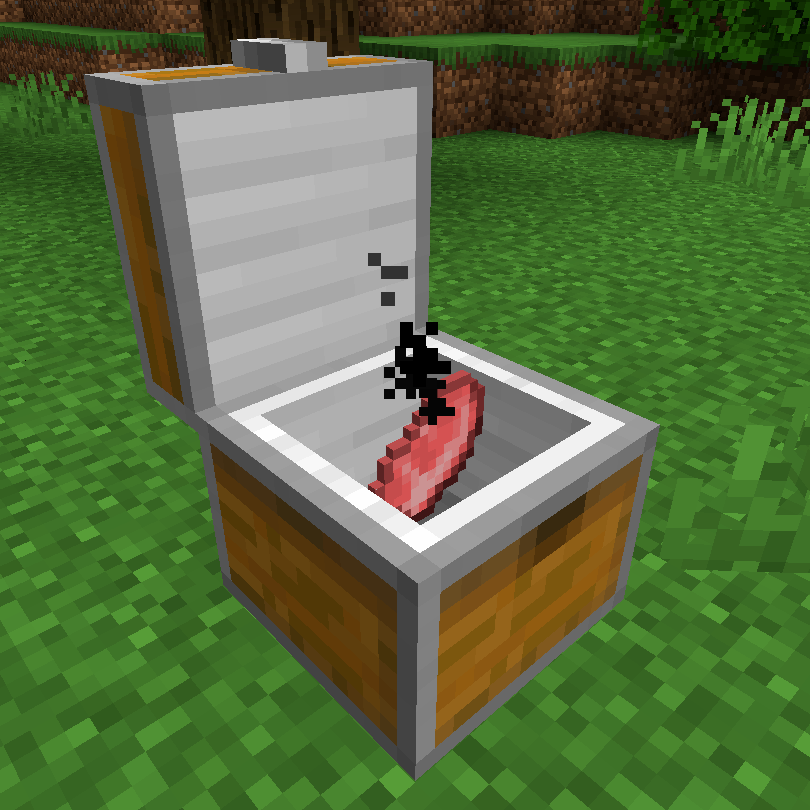

# Solar Cooker 

[.svg)](https://www.curseforge.com/minecraft/mc-mods/solar-cooker)
[.svg)](https://www.curseforge.com/minecraft/mc-mods/solar-cooker/files)

This is a Minecraft mod that adds a **Solar Cooker** to the game. (Forge, NeoForge, Fabric, Quilt)

The Fabric / Quilt version needs the following mods:

- Fabric API ([Github](https://github.com/FabricMC/fabric), [Curseforge](https://www.curseforge.com/minecraft/mc-mods/fabric-api), [Modrinth](https://modrinth.com/mod/fabric-api))
- Cloth Config API ([Github](https://github.com/shedaniel/cloth-config), [Curseforge](https://www.curseforge.com/minecraft/mc-mods/cloth-config), [Modrinth](https://modrinth.com/mod/cloth-config))

It acts like a furnace but needs sunlight instead of fuel.

In default configuration all smelting recipes (before 1.21 all smoking recipes) are working in the Solar Cooker, and they need 4 times more time than in a vanilla Furnace.

The mod is configurable, and you can change the recipes to "smoking" or "blasting". You can configure the cook time factor and blacklist recipes as well as add recipes via datapacks.

For more information check out the **Wiki**: https://github.com/cech12/SolarCooker/wiki
